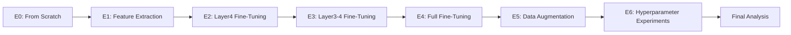
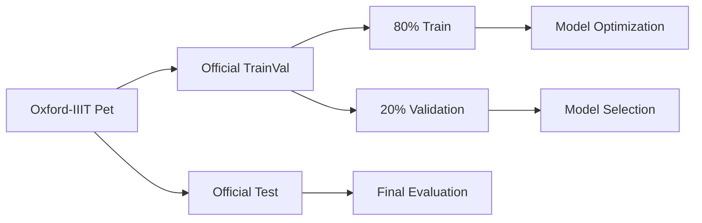

# ResNet-50 Transfer Learning on Oxford-IIIT Pet

A controlled experimental study of **ResNet-50 transfer learning** on the **Oxford-IIIT Pet** 37-class image classification task.

The project investigates how much of an ImageNet-pretrained representation should be adapted to the target task, and how data augmentation and optimization hyperparameters affect generalization.

---

## Project Objective

The central question of the project is:

> **How much transfer learning and fine-tuning is actually necessary for a fine-grained image classification task?**

The experiments progress from a randomly initialized model to increasingly deeper adaptation of an ImageNet-pretrained ResNet-50.



---

## Dataset

The project uses the **Oxford-IIIT Pet** dataset.

### Dataset characteristics

- 37 pet-breed classes
- Official `trainval` partition
- Official `test` partition
- Stratified 80/20 split of `trainval` into training and validation sets
- Fixed `random_state=42`
- Input resolution: $224\times224$

The official test set is kept separate from model selection and hyperparameter tuning.

### Data pipeline



### Training preprocessing

```text
RandomResizedCrop
→ RandomHorizontalFlip
→ ToTensor
→ ImageNet Normalization
```

### Validation / Test preprocessing

```text
Resize
→ CenterCrop
→ ToTensor
→ ImageNet Normalization
```

---

## Experimental Setup

All baseline experiments use:

| Setting | Value |
|---|---|
| Architecture | ResNet-50 |
| Pretrained initialization | ImageNet for E1-E6 |
| Input size | $224\times224$ |
| Classes | 37 |
| Batch size | 16 |
| Epochs | 30 |
| Loss | Cross-Entropy |
| Optimizer | AdamW |
| Baseline learning rate | $10^{-3}$ |
| Weight decay | $10^{-4}$ |
| Scheduler | Cosine Annealing |
| Random seed | 42 |

E5 and E6 intentionally change only the variables under investigation.

---

# Experiments

## E0 — ResNet-50 From Scratch

E0 establishes the baseline without transfer learning.

- ResNet-50 from Torchvision
- `weights=None`
- Random initialization
- All parameters trainable
- Final classifier adapted to 37 classes

This experiment answers:

> **How well can the model learn the task without ImageNet pretraining?**

### Result

| Metric | Result |
|---|---:|
| Best validation accuracy | 33.83% |
| Test accuracy | 28.89% |
| Test loss | 2.5003 |

The result establishes a weak baseline compared with the ImageNet-pretrained experiments.

---

## E1 — Feature Extraction

E1 loads an ImageNet-pretrained ResNet-50.

The complete backbone is frozen:

```text
Conv1
Layer1
Layer2
Layer3
Layer4
    ↓ frozen
FC
    ↓ trainable
```

Only the 37-class classifier is optimized.

### Result

| Metric | Result |
|---|---:|
| Trainable parameters | 75,813 |
| Best epoch | 16 |
| Best validation accuracy | 93.75% |
| Best validation loss | 0.2152 |
| Test accuracy | 91.14% |
| Test loss | 0.2922 |

E1 demonstrates the strength of reusing a pretrained ImageNet representation without modifying the backbone.

---

## E2 — Layer4 Fine-Tuning

E2 keeps the early backbone frozen but allows the final ResNet stage to adapt.

```text
Conv1   → Frozen
Layer1  → Frozen
Layer2  → Frozen
Layer3  → Frozen
Layer4  → Trainable
FC      → Trainable
```

The experiment investigates whether high-level features benefit from target-task adaptation.

### Result

| Metric | Result |
|---|---:|
| Trainable parameters | 13,662,277 |
| Best epoch | 21 |
| Best validation accuracy | 94.70% |
| Best validation loss | 0.1958 |
| Test accuracy | 91.20% |
| Test loss | 0.3668 |

E2 improved validation performance, but the improvement on the official test set over E1 was negligible.

---

## E3 — Layer3 + Layer4 Fine-Tuning

E3 additionally unfreezes Layer3.

```text
Conv1   → Frozen
Layer1  → Frozen
Layer2  → Frozen
Layer3  → Trainable
Layer4  → Trainable
FC      → Trainable
```

### Result

| Metric | Result |
|---|---:|
| Trainable parameters | 22,138,917 |
| Trainable ratio | 93.87% |
| Best epoch | 26 |
| Best validation accuracy | 92.93% |
| Best validation loss | 0.2658 |
| Test accuracy | 87.95% |
| Test loss | 0.4682 |

E3 produced stronger fitting to the training data, but observed test generalization deteriorated substantially.

---

## E4 — Full Fine-Tuning

E4 removes the remaining freezing constraint.

```text
Conv1   → Trainable
Layer1  → Trainable
Layer2  → Trainable
Layer3  → Trainable
Layer4  → Trainable
FC      → Trainable
```

All parameters are initialized from ImageNet-pretrained weights and then updated.

### Result

| Metric | Result |
|---|---:|
| Best epoch | 28 |
| Best validation accuracy | 91.30% |
| Best validation loss | 0.3435 |
| Test accuracy | 87.22% |
| Test loss | 0.4868 |

Under the initial optimization configuration, full fine-tuning performed worse than shallow fine-tuning.

---

# E5 — Data Augmentation

E5 investigates whether stronger training-time augmentation improves generalization.

The model remains fully fine-tuned and the optimization configuration remains fixed.

The tested policies were:

```text
Baseline
ColorJitter
RandomRotation
ColorJitter + RandomRotation
```

### Validation results

| Policy | Best validation accuracy |
|---|---:|
| Baseline | 90.90% |
| ColorJitter | **91.71%** |
| Rotation | 91.17% |
| Combined | 90.90% |

### Final E5 result

| Metric | Result |
|---|---:|
| Selected policy | ColorJitter |
| Validation accuracy | 91.71% |
| Test accuracy | 87.63% |
| Test loss | 0.4724 |

The augmentation improvement was modest and did not recover the performance lost by the initial full fine-tuning configuration.

---

# E6 — Hyperparameter Experiments

E6 investigates optimization rather than model architecture.

Two hyperparameters were evaluated.

### Learning rate

$$
\eta \in
\left\{
3\times10^{-4},
10^{-3},
3\times10^{-3}
\right\}
$$

### Weight decay

$$
\lambda \in
\left\{
10^{-5},
10^{-4},
10^{-3}
\right\}
$$

The search was staged:

```text
Learning-rate sweep
        ↓
Select best learning rate
        ↓
Weight-decay sweep
        ↓
Select final configuration
        ↓
Final test evaluation
```

## Learning-rate sweep

| Learning rate | Best validation accuracy |
|---:|---:|
| $3\times10^{-4}$ | **93.07%** |
| $10^{-3}$ | 90.22% |
| $3\times10^{-3}$ | 38.99% |

The result shows that the original $10^{-3}$ learning rate was not well suited to the full fine-tuning configuration, while $3\times10^{-3}$ was too aggressive.

## Weight-decay sweep

With the selected learning rate fixed at:

$$
\eta=3\times10^{-4}
$$

| Weight decay | Best validation accuracy |
|---:|---:|
| $10^{-5}$ | 93.75% |
| $10^{-4}$ | **94.16%** |
| $10^{-3}$ | 94.02% |

The final configuration was:

$$
\boxed{
\eta=3\times10^{-4},
\quad
\lambda=10^{-4}
}
$$

### Final E6 result

| Metric | Result |
|---|---:|
| Best validation accuracy | 94.16% |
| Test accuracy | 90.46% |
| Test loss | 0.3703 |

The hyperparameter adjustment recovered a substantial portion of the performance lost by E4.

---

# Final Results

The main test-set results are:

| Experiment | Strategy | Test Accuracy | Test Loss |
|---|---|---:|---:|
| E0 | From Scratch | **28.89%** | 2.5003 |
| E1 | Feature Extraction | **91.14%** | 0.2922 |
| E2 | Layer4 + FC Fine-Tuning | **91.20%** | 0.3668 |
| E3 | Layer3 + Layer4 + FC | **87.95%** | 0.4682 |
| E4 | Full Fine-Tuning | **87.22%** | 0.4868 |
| E5 | Full Fine-Tuning + ColorJitter | **87.63%** | 0.4724 |
| E6 | Tuned Full Fine-Tuning | **90.46%** | 0.3703 |

The observed progression is:


---

# Main Findings

## ImageNet pretraining is the dominant factor

The difference between E0 and E1 is dramatic:

$$
91.14\% - 28.89\%
=
62.25\text{ pp}
$$

The experiment strongly demonstrates the value of transfer learning for this task.

## Shallow adaptation was highly competitive

E1 and E2 produced the strongest test accuracy:

$$
E2 = 91.20\%
$$

$$
E1 = 91.14\%
$$

Allowing Layer4 to adapt improved validation performance, but produced only a negligible test improvement over feature extraction.

## Deeper fine-tuning was not automatically better

E3 and E4 both performed worse on the official test set than E1 and E2.

More trainable parameters did not automatically imply better generalization under the baseline optimization recipe.

## Optimization mattered substantially

E6 improved the E4 test result:

$$
87.22\% \rightarrow 90.46\%
$$

which is:

$$
+3.24\text{ pp}
$$

The learning-rate sweep showed strong sensitivity to the optimization scale.

## Simple augmentation had limited impact

ColorJitter improved the E4-style result only modestly:

$$
87.22\% \rightarrow 87.63\%
$$

The combined ColorJitter + Rotation policy did not outperform ColorJitter alone.

---

# Validation vs Test

One of the strongest observations is that validation performance does not perfectly predict test performance.

Approximate validation-test gaps:

| Experiment | Validation | Test | Gap |
|---|---:|---:|---:|
| E1 | 93.75% | 91.14% | 2.61 pp |
| E2 | 94.70% | 91.20% | 3.50 pp |
| E3 | 92.93% | 87.95% | 4.98 pp |
| E4 | 91.30% | 87.22% | 4.08 pp |
| E5 | 91.71% | 87.63% | 4.08 pp |
| E6 | 94.16% | 90.46% | 3.70 pp |

---

# Reproducibility

The experiments use:

```text
Seed = 42
```

The train-validation split is recreated from the official `trainval` partition using stratification.

Each major experiment stores its result in:

```text
experiments/results/
```

and model checkpoints in:

```text
experiments/checkpoints/
```

The central experiment summary is:

```text
experiments/results/experiment_results.csv
```

---

# Environment

The project was developed with:

```text
Python 3.11
PyTorch 2.6.0 + CUDA 12.4
Torchvision 0.21.0 + CUDA 12.4
uv
```

Hardware used during the experiments included an NVIDIA GeForce GTX 1650.

---

# Learning Objectives

This project was designed to connect theory with practice across:

- Transfer Learning
- Feature Extraction
- Fine-Tuning
- Freezing and unfreezing neural-network layers
- CNN feature hierarchies
- Forward and backward propagation
- Parameter optimization
- Data augmentation
- Hyperparameter tuning
- Validation-based model selection
- Test-set evaluation
- Generalization and overfitting
- Experimental design and reproducibility

---

# Conclusion

The project demonstrates that transfer learning is not simply a binary choice between pretrained and non-pretrained models.

There is a spectrum:

$$
\text{Feature Extraction}
\rightarrow
\text{Partial Fine-Tuning}
\rightarrow
\text{Full Fine-Tuning}
$$

The amount of adaptation must be matched to the target dataset and optimization setup.

For this experiment, the strongest observed test-set performance came from:

$$
\boxed{
\text{E2 — Layer4 Fine-Tuning}
}
$$

with:

$$
\boxed{
91.20\%\text{ test accuracy}
}
$$

closely followed by E1 at 91.14%.

Full fine-tuning initially underperformed, but hyperparameter tuning recovered much of that gap, reaching 90.46%.

The main lesson is:

> **Transfer learning provides the largest performance gain, while the depth of fine-tuning and optimization strategy determine how effectively that pretrained representation generalizes to the target task.**
